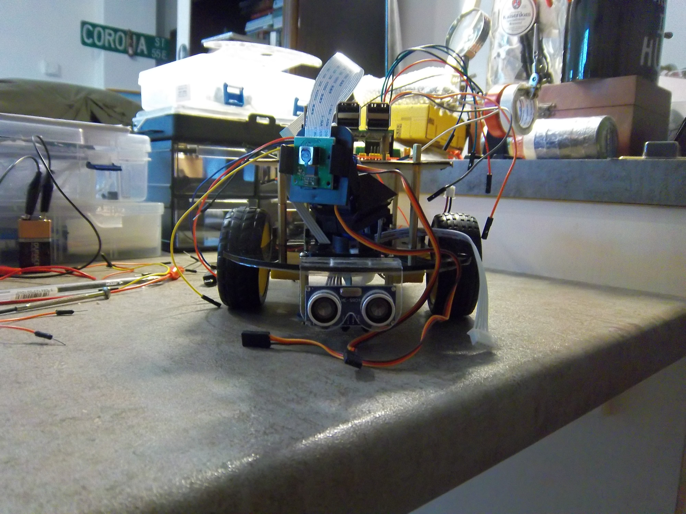

# Odisseus Raspberry Pi



This fixes hotfix_branch_4 
This is a normal branch that fixes things

This is a major change. On hotfix 2.

This is a very serious error to be fixed. I am fixing it now. Seriously...........
This is a very serious error to be fixed. I am fixing it now. Seriously.


This is my attempt to develop a two wheels multi-sensor robot using Raspberry Pi. 
There is also a simulation based on ROS which is in progress here: https://github.com/pockerman/odisseus_ros  

## Contents
* [Hardware](#hardware)
* [Software](#software)
	* [Dependencies](#dependencies)
	* [Desing Notes](#design_notes) 
* [Installation](#installation)
* [Useful Links](#useful_links)
* [How To](#how_to)
	* [Start the Flask-based Control Server](#start_control_server)
* [Useful Links](#useful_links)

 

## <a name="hardware"></a> Hardware

- 2 Wheels
- 2 DC motors
- A Pi camera
- An ultrasound sensor (e.g. HC-SR04)
- An IR sensor
- An L289N H-bridge

## <a name="software"></a> Software

### <a name="dependencies"></a> Dependencies

- **```RPi.GPIO```**

### <a name="design_notes"></a> Design Notes

Checkout the design notes <a href="doc/notes.pdf">here</a>.

## <a name="installation"></a> Installation

Install the following components

- **```RPi.GPIO```**

```
sudo apt-get install python-dev
sudo apt-get install python-rpi.gpio

```

## <a name="how_to"></a> How To


### <a name="start_control_server"></a> Start the Flask-based control server


- ```python3 odisseus_web_app.py```

## <a name="useful_links"></a> Useful Links

- **Installing CircuitPython Libraries on Raspberry Pi:** https://learn.adafruit.com/circuitpython-on-raspberrypi-linux/installing-circuitpython-on-raspberry-pi
- https://cdn-learn.adafruit.com/downloads/pdf/adafruit-dc-and-stepper-motor-hat-for-raspberry-pi.pdf
- **HC-SR04 On Raspberry Pi:** https://thepihut.com/blogs/raspberry-pi-tutorials/hc-sr04-ultrasonic-range-sensor-on-the-raspberry-pi
