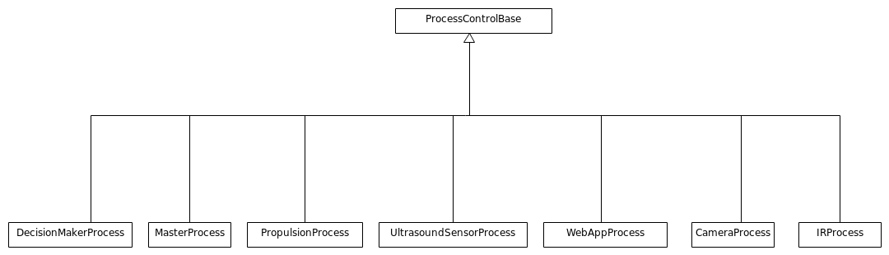
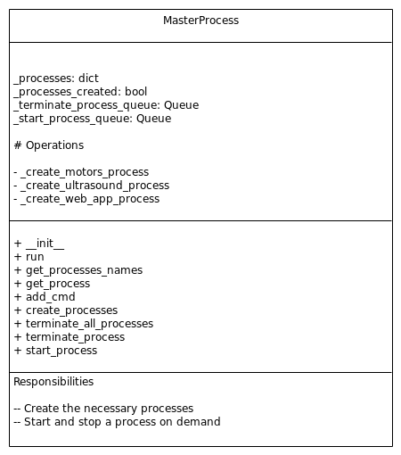
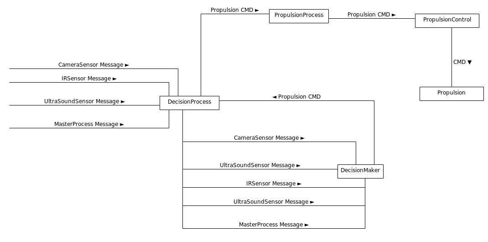
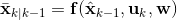
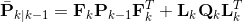
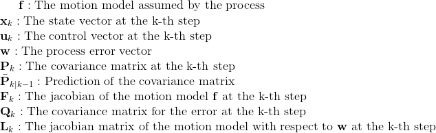
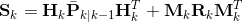
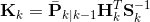
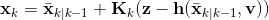
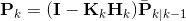

# Odisseus Raspberry Pi


This is my attempt to develop a two wheels multi-sensor robot using Raspberry Pi. There is also a simulation based on ROS which is in progress here: https://github.com/pockerman/odisseus_ros  


## Contents
* [Hardware](#hardware)
* [Software](#software)
	* [Dependencies](#dependencies)
	* [Desing Notes](#design_notes) 
		* [The ```MasterProcess```](#master_process)
		* [The ```WebAppProcess```](#webap_process)
		* [The ```CameraProcess```](#camera_process)
		* [The ```IRProcess```](#ir_process)
		* [The ```UltrasoundSensorProcess```](#ultrasound_process)
		* [The ```PropulsionProcess```](#propulsion_process)
		* [The ```DecisionMakerProcess```](#decision_process)
* [Localization](#localization)
		* [Extended Kalman Filter](#extended_kalman_filter)
* [Installation](#installation)
* [Useful Links](#useful_links)
* [How To](#how_to)
	* [Start the Flask-based Control Server](#start_control_server)
* [Useful Links](#useful_links)

 

## <a name="hardware"></a> Hardware

- 2 Wheels
- 2 DC motors
- A Pi camera
- An ultrasound sensor (e.g. HC-SR04)
- An IR sensor
- An L289N H-bridge

## <a name="software"></a> Software

### <a name="dependencies"></a> Dependencies

**TODO**

### <a name="design_notes"></a> Design Notes

Odisseus is a multiprocess application. All its sensors as well as its motors run on a separate process.
These processes are

- ```MasterProcess```
- ```WebAppProcess```
- ```CameraProcess```
- ```IRProcess```
- ```UltrasoundSensorProcess```
- ```PropulsionProcess```
- ```DecisionMakerProcess```

The following image shows the inheritance diagram



The processes communicate with each other via messages which are explained below.


#### <a name="master_process"></a> The ```MasterProcess``` 

The ```MasterProcess``` 



#### <a name="webap_process"></a> The ```WebAppProcess```

#### <a name="camera_process"></a> The ```CameraProcess```

#### <a name="ir_process"></a> The ```IRProcess```

#### <a name="ultrasound_process"></a> The ```UltrasoundSensorProcess```

#### <a name="propulsion_process"></a> The ```PropulsionProcess```

#### <a name="decision_process"></a> The ```DecisionProcess```

This process is perhaps the busiest of all. Its main task is to receive messages form the sensors and 
the master process and create a command for the ```PropulsionProcess```. Pictorially, this is shown in the
figure below




## <a name="localization"></a> Localization 

### <a name="extended_kalman_filter"></a> Extended Kalman Filter

The Extended Kalman Filter is an extension for non-linear systems of the very popular <a href="https://en.wikipedia.org/wiki/Kalman_filter">Kalman Filter</a>.
Just like the original Kalman Filter algorithm, the EKF algorithm also has two steps namely predict and update. 
The main difference of EKF over Kalman Filter is that it introduces a linearization of the non-linear system. Overall the algorithm is as follows

#### Predict Step





where the following notation is used



Just like the Kalman Filter, EKF maintains the notion of the covariance matrix. 
The update step is summarized below. 

#### Update Step










## <a name="installation"></a> Installation

- **TODO**

## <a name="how_to"></a> How To


### <a name="start_control_server"></a> Start the Flask-based control server


- ```python3 odisseus_web_app.py```

## <a name="useful_links"></a> Useful Links

- **Installing CircuitPython Libraries on Raspberry Pi:** https://learn.adafruit.com/circuitpython-on-raspberrypi-linux/installing-circuitpython-on-raspberry-pi
- https://cdn-learn.adafruit.com/downloads/pdf/adafruit-dc-and-stepper-motor-hat-for-raspberry-pi.pdf
- **HC-SR04 On Raspberry Pi:** https://thepihut.com/blogs/raspberry-pi-tutorials/hc-sr04-ultrasonic-range-sensor-on-the-raspberry-pi
