# Odisseus Raspberry Pi


This is my attempt to develop a two wheels multi-sensor robot using Raspberry Pi. 
There is also a simulation based on ROS which is in progress here: https://github.com/pockerman/odisseus_ros  

## Contents
* [Hardware](#hardware)
* [Software](#software)
	* [Dependencies](#dependencies)
	* [Desing Notes](#design_notes) 
* [Installation](#installation)
* [Useful Links](#useful_links)
* [How To](#how_to)
	* [Start the Flask-based Control Server](#start_control_server)
* [Useful Links](#useful_links)

 

## <a name="hardware"></a> Hardware

- 2 Wheels
- 2 DC motors
- A Pi camera
- An ultrasound sensor (e.g. HC-SR04)
- An IR sensor
- An L289N H-bridge

## <a name="software"></a> Software

### <a name="dependencies"></a> Dependencies

- **```RPi.GPIO```**

### <a name="design_notes"></a> Design Notes

Checkout the design notes <a href="doc/notes.pdf">here</a>.


## <a name="modeling"></a> Modeling

Odisseus is using the following kinematic model 

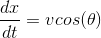

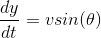

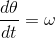

where 

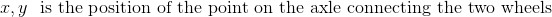

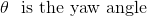

and 

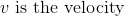

The velocity is one of the inputs that is given to the system. Namely, it is calculated according to

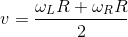

where 

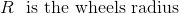

and 

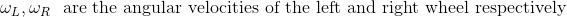

Similarly the second input to the system is the angular velocity of the robot which is given by 

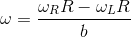

This kinematic model is used as a motion model in the Extended Kalman Filter below. Concretely, the following discretized 
form is utilized 

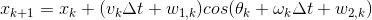

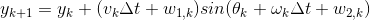

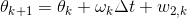

where

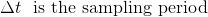

and

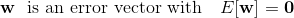


## <a name="localization"></a> Localization 

### <a name="extended_kalman_filter"></a> Extended Kalman Filter

The Extended Kalman Filter is an extension for non-linear systems of the very popular <a href="https://en.wikipedia.org/wiki/Kalman_filter">Kalman Filter</a>.
Just like the original Kalman Filter algorithm, the EKF also has two steps namely predict and update. 
The main difference of EKF over Kalman Filter is that it introduces a linearization of the non-linear system. Overall the algorithm is as follows

#### Predict Step


where the following notation is used


Just like the Kalman Filter, EKF maintains the notion of the covariance matrix. 
The update step is summarized below. 

#### Update Step


#### Straight Motion Scenario

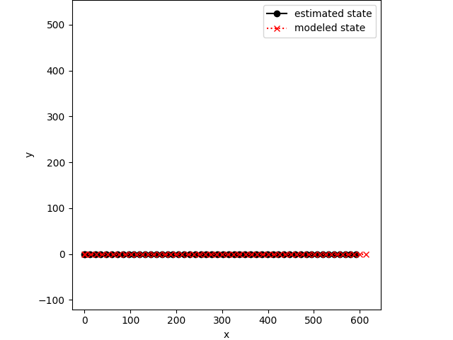

#### Change Direction Scenario

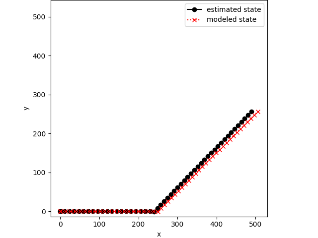

## <a name="installation"></a> Installation

Install the following components

- **```RPi.GPIO```**

```
sudo apt-get install python-dev
sudo apt-get install python-rpi.gpio

```

## <a name="how_to"></a> How To


### <a name="start_control_server"></a> Start the Flask-based control server


- ```python3 odisseus_web_app.py```

## <a name="useful_links"></a> Useful Links

- **Installing CircuitPython Libraries on Raspberry Pi:** https://learn.adafruit.com/circuitpython-on-raspberrypi-linux/installing-circuitpython-on-raspberry-pi
- https://cdn-learn.adafruit.com/downloads/pdf/adafruit-dc-and-stepper-motor-hat-for-raspberry-pi.pdf
- **HC-SR04 On Raspberry Pi:** https://thepihut.com/blogs/raspberry-pi-tutorials/hc-sr04-ultrasonic-range-sensor-on-the-raspberry-pi
